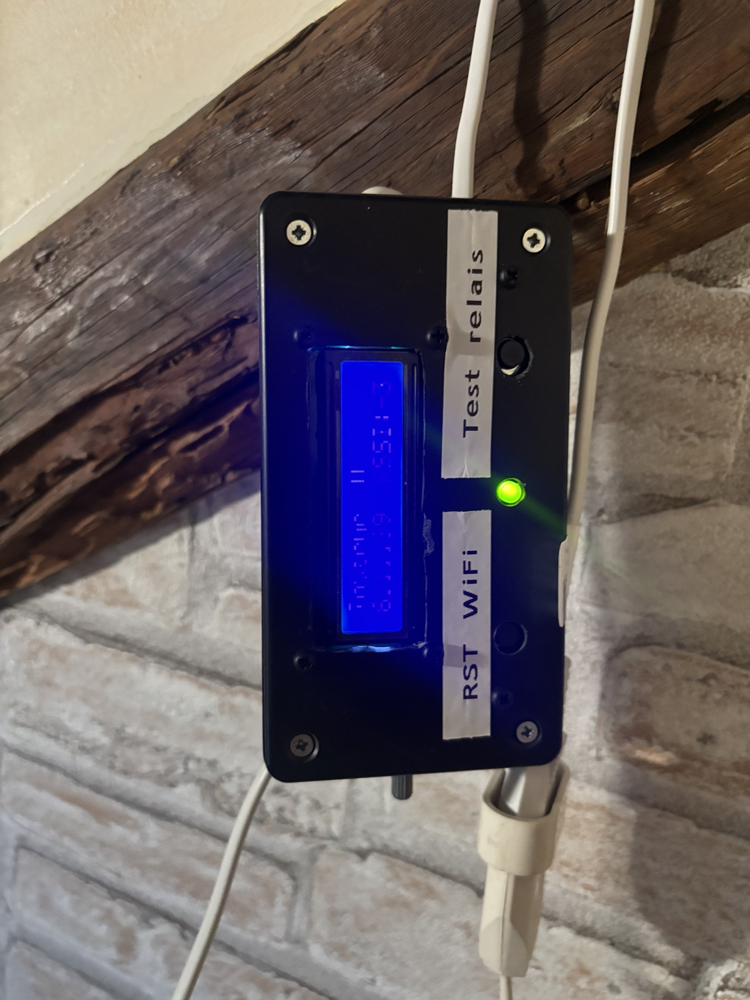

# Watchdog routeur 4G — ESP32

Un ESP32 surveille l'accès Internet d'un routeur 4G et peut redémarrer son alimentation par relais après une panne confirmée. Le boîtier installé à Saint-Clément-sur-Durance dispose d'un LCD 16×2, de boutons, d'une LED et d'une interface Web locale.

*ESP32 watchdog for a 4G router, with Internet checks, relay power cycling, LCD status and a local web interface.*

**Attention aux versions :** le fichier nommé `WatchdogRouteur4GV3.ino` est *probablement* celui installé ; cette identification reste à confirmer sur l'ESP32. Les variantes SAFE OFF et I²C ci-dessous **n'ont pas encore été testées à Saint-Clément**. Les photos montrent le montage en service, pas ces nouvelles variantes.

## Trois firmwares distincts

| Fichier | LCD | OFF depuis le Web | État |
| --- | --- | --- | --- |
| [`WatchdogRouteur4GV3.ino`](firmware/WatchdogRouteur4GV3/WatchdogRouteur4GV3.ino) | Parallèle, 6 fils de commande | Pas de minuterie dédiée : la surveillance Internet ou un redémarrage de l'ESP32 peuvent le réalimenter ; durée non garantie | Probablement installé ; identification exacte à confirmer |
| [`WatchdogRouteur4G_V2_2_SAFE_OFF.ino`](firmware/WatchdogRouteur4G_V2_2_SAFE_OFF/WatchdogRouteur4G_V2_2_SAFE_OFF.ino) | Parallèle, mêmes broches | Remise sous tension automatique après 5 min | Non testé sur site |
| [`WatchdogRouteur4G_V2_3_I2C_LCD_SAFE_OFF.ino`](firmware/WatchdogRouteur4G_V2_3_I2C_LCD_SAFE_OFF/WatchdogRouteur4G_V2_3_I2C_LCD_SAFE_OFF.ino) | I²C, SDA 21 / SCL 22 | Remise sous tension automatique après 5 min | Non testé sur site |

Le nom « V3 » est celui du fichier reçu ; son commentaire d'en-tête indique « V2 fiabilisée ». Les trois sources sont conservées **sans modification**. Il n'y a pas de version GitHub marquée comme nouvelle version stable tant que l'installation et les essais ne sont pas confirmés.

## Fonctionnement commun

- Test Internet HTTP toutes les **60 secondes** : Google 204, puis Cloudflare 204 en secours.
- **3 échecs consécutifs** après un état Internet précédemment confirmé provoquent une coupure du routeur de **10 secondes**, suivie d'une attente de démarrage de **90 secondes**. Il faut **2 succès consécutifs** pour rétablir l'état « Internet OK ».
- Limite par défaut de **48 redémarrages du routeur par jour**. Le compteur est conservé et réinitialisé au changement de jour lorsque l'heure NTP est valide.
- Interface Web locale : états, commandes du relais, configuration Wi-Fi et historique des événements. Affichage LCD alterné avec défilement des informations.
- Au démarrage de l'ESP32, le relais est placé en position **routeur alimenté** (`LOW`).

Le watchdog commande **l'alimentation du routeur**, pas le trafic réseau 4G.

## Câblage défini dans les sources

| Élément | Toutes les versions |
| --- | --- |
| Relais routeur | GPIO 16 : `LOW` = alimenté, `HIGH` = coupé |
| LED Internet | GPIO 23 |
| Bouton test/redémarrage routeur | GPIO 25 |
| Bouton reset Wi-Fi (appui d'environ 3 s) | GPIO 27 |

| LCD | V3 probable / V2.2 SAFE OFF | V2.3 I²C |
| --- | --- | --- |
| Connexions | RS 13, E 12, D4 14, D5 32, D6 33, D7 26 | SDA 21, SCL 22 ; adresse `0x27` dans le code |
| Rétroéclairage | Écran parallèle existant | Bouton GPIO 26 vers GND : réveil du rétroéclairage pendant 3 min |

**Ne pas flasher la variante I²C sur le montage câblé pour le LCD parallèle sans adapter le matériel.** Vérifier le comportement du relais avant de brancher le routeur.

## Photos de l'installation actuelle

[Boîtier installé](images/watchdog-installed-wide.jpeg) · [Routeur 4G](images/router-4g.jpeg) · [État Web](images/web-status.jpeg) · [Historique Web](images/web-history.png)

Ces captures illustrent le fonctionnement de l'installation existante. Elles ne valident pas le retour automatique après cinq minutes des deux variantes SAFE OFF.

## Ouvrir un sketch

Chaque `.ino` est placé dans un dossier de même nom pour l'ouvrir dans l'IDE Arduino. Les versions à LCD parallèle utilisent `LiquidCrystal.h` ; la variante I²C utilise `Wire.h` et `LiquidCrystal_I2C.h`. Toutes utilisent `WiFi.h`, `HTTPClient.h`, `Preferences.h`, `AsyncTCP.h` et `ESPAsyncWebServer.h` avec le support ESP32 pour Arduino.

Au premier démarrage sans identifiants enregistrés, l'ESP32 crée le point d'accès `ESP32_Config`. **Changer son mot de passe par défaut défini dans chaque sketch avant une nouvelle installation.** Les commandes de l'interface Web fournie n'ont pas d'authentification ; réserver son accès au réseau local ou à un accès privé maîtrisé.

## Essais à réaliser avant de remplacer le firmware installé

1. Identifier la version exacte présente sur le boîtier et sauvegarder son binaire ou son source si possible.
2. Vérifier la remise sous tension du routeur au démarrage de l'ESP32.
3. Sur V2.2 et V2.3, demander « 4G OFF » depuis le Web et confirmer le retour d'alimentation après cinq minutes, même si l'interface devient inaccessible pendant la coupure.
4. Sur V2.3, confirmer l'adresse I²C, le câblage et l'extinction/réveil du rétroéclairage après trois minutes.
5. Tester le redémarrage après panne Internet, le compteur quotidien et les journaux.

Schéma de câblage éditable et licence de réutilisation : à définir avant une diffusion présentée comme projet reproductible complet.
